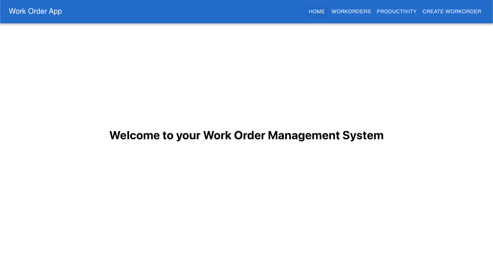
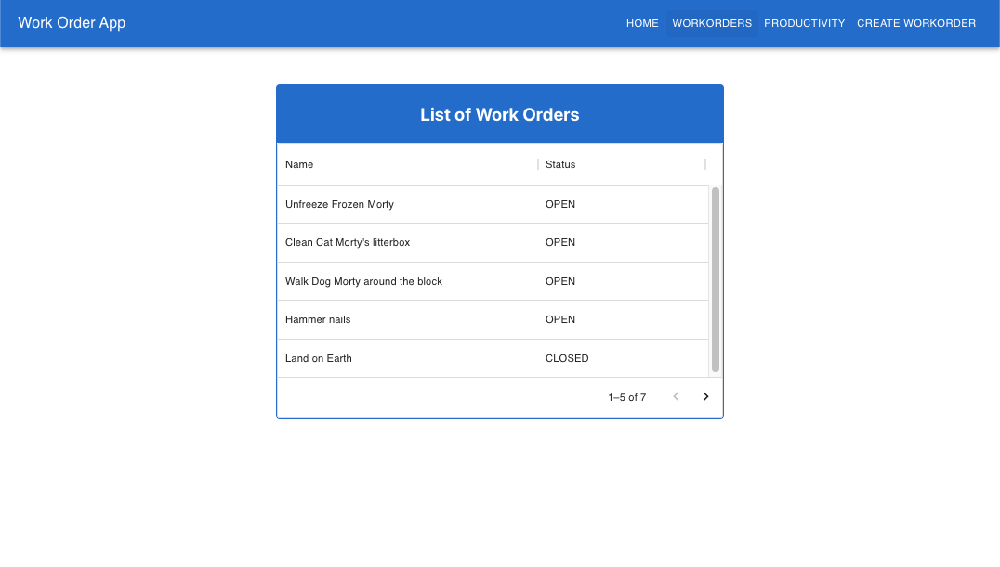
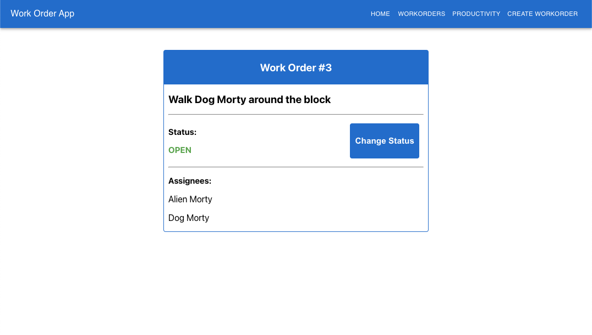
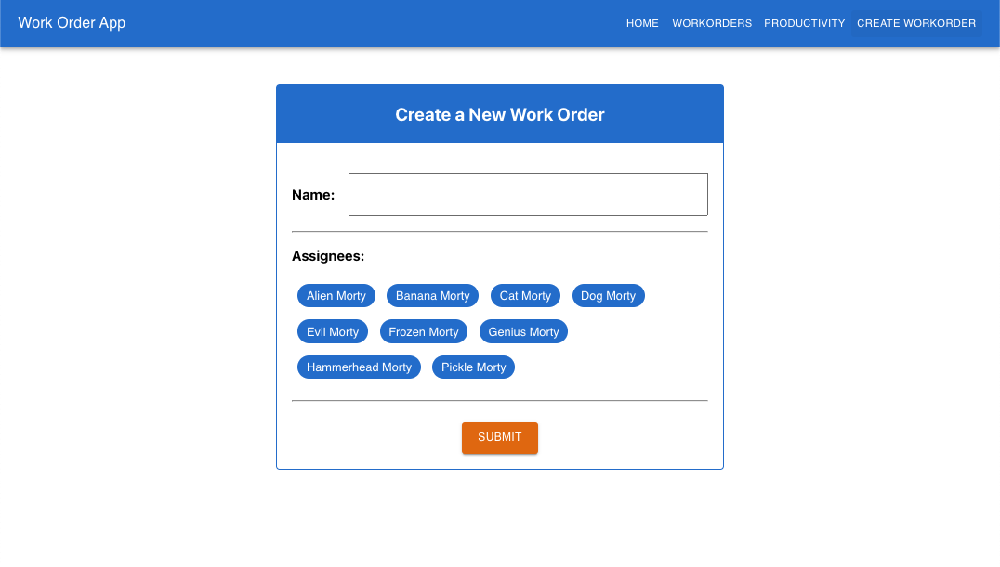
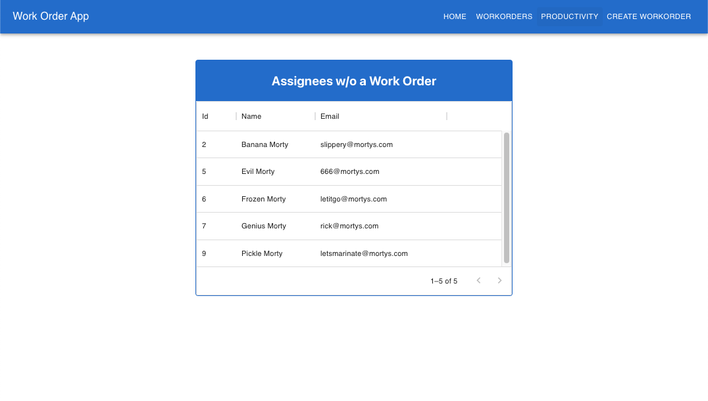

# work-order-web-app

## The App

An online work order app. A user can search for existing work orders, create new work orders, and update work orders.

## Technologies

- Typsecript
- Node
- Express
- SQLite
- React
- MUI + vanilla CSS

## Images

#### Home Page

#### Work Orders List Page

#### Work Order Details Page

#### Create Work Order Form Page

#### Assignees Page

